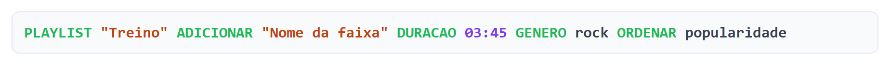
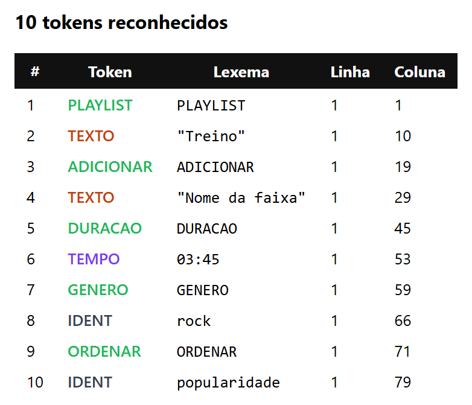
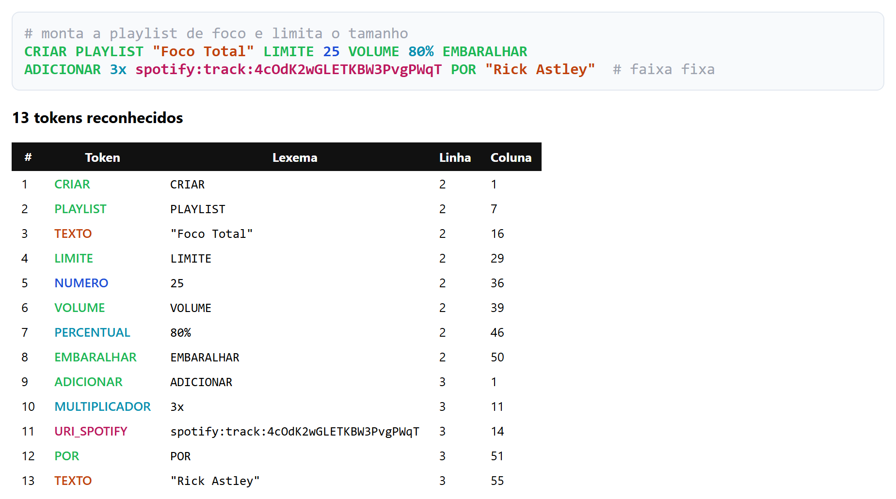
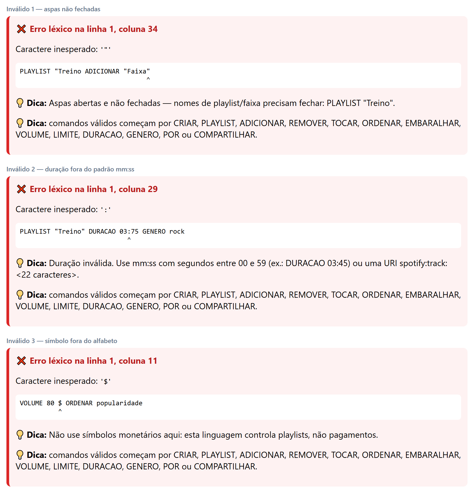
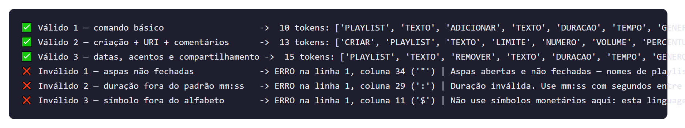
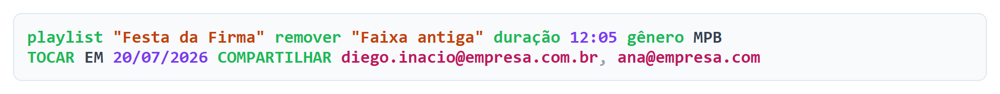
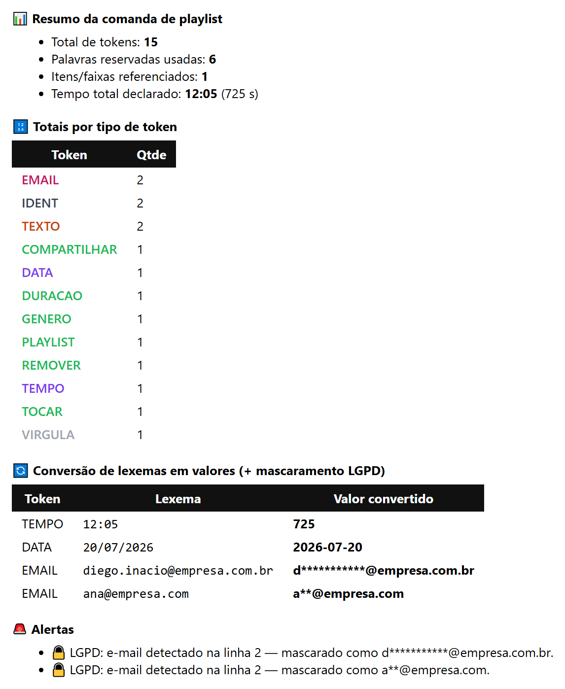

# 🎧 Analisador Léxico — Comandos de Playlist (Spotify)

> **Desafio CP05 — Tema 5: Comandos de playlist (Spotify)**
> Analisador léxico de uma mini-linguagem de comandos de playlist, construído com
> [Lark](https://lark-parser.readthedocs.io/) e interface interativa em `ipywidgets`.

[](https://www.python.org/)
[](https://lark-parser.readthedocs.io/)
[](analisador_lexico_spotify_tema5.ipynb)
[](https://colab.research.google.com/github/ZeHGGS/cp05-analisador-lexico-spotify/blob/main/analisador_lexico_spotify_tema5.ipynb)

🌐 **Página do projeto:** https://ZeHGGS.github.io/cp05-analisador-lexico-spotify/

### Integrantes

| Nome | RA |
|---|---|
| Diego Azevedo Dias Ignacio | 2392072 |
| Gabriella Pereira Rodrigues | 2334425 |
| Giovanna Bispo Da Silva | 2367880 |
| José Henrique Guimarães Galvão Silva | 249994 |

---

## 📌 Sobre o projeto

A linguagem permite escrever comandos de manipulação de playlists em português, no estilo:

```
PLAYLIST "Treino" ADICIONAR "Nome da faixa" DURACAO 03:45 GENERO rock ORDENAR popularidade
```

O analisador lê o texto, reconhece os tokens, exibe o código colorido, monta a tabela de tokens
(com linha e coluna) e gera um painel de pós-processamento com totais, conversões e alertas.

Pintar cada lexema com a cor da sua categoria é exatamente o que o *syntax highlight* de um editor faz —
e é a forma mais direta de enxergar o que o lexer entendeu:



A saída propriamente dita é o **fluxo de tokens**, cada um com tipo, lexema, linha e coluna:



---

## 🚀 Como executar

### Google Colab (recomendado)

1. Clique no botão **Open in Colab** no topo deste README (ou faça upload de `analisador_lexico_spotify_tema5.ipynb`).
2. Descomente e rode a primeira célula:
   ```python
   !pip install -q lark ipywidgets
   ```
3. Execute todas as células (`Ambiente > Executar tudo`).

### Jupyter local

```bash
pip install lark ipywidgets notebook
jupyter notebook analisador_lexico_spotify_tema5.ipynb
```

> A interface depende de `ipywidgets`. No VS Code, instale também a extensão Jupyter.
> O GitHub exibe o notebook, mas **não executa os widgets** — eles precisam de um kernel ativo.

---

## 📂 Estrutura do notebook

| Seção | Conteúdo |
|---|---|
| Cabeçalho | Tema, integrantes e exemplo de entrada |
| Preparando o ambiente | Instalação e imports (`lark`, `ipywidgets`) |
| 1) Gramática do lexer | Terminais com prioridade, `DICAS_DESAFIO` e `tokenizar_desafio` |
| 2) Funções de apresentação | `texto_colorido_html`, `tabela_tokens_html`, `erro_lexico_html` |
| 3) Pós-processamento (bônus) | Conversões, mascaramento LGPD, `resumo_html` |
| 4) Casos de teste | `casos_desafio` (3 válidos + 3 inválidos) e `testar` |
| 5) Interface | `interface_lexer` com duas abas |
| 6) Diário de ambiguidade | Análise do conflito principal |

---

## 🔤 Tabela de tokens

São **23 tipos de token** (13 palavras reservadas, 8 literais com regex e 2 genéricos), mais 2 padrões ignorados.

### Tokens especiais do domínio

| # | Token | Descrição | Regex | Exemplo | Prio |
|---|-------|-----------|-------|---------|:---:|
| 1 | `URI_SPOTIFY` | URI nativa do Spotify (ID de 22 caracteres base62) | `/spotify:(?:track\|album\|artist\|playlist):[A-Za-z0-9]{22}\b/i` | `spotify:track:4cOdK2wGLETKBW3PvgPWqT` | **9** |
| 2 | `EMAIL` | E-mail de colaborador (dado sensível → LGPD) | `/[A-Za-z0-9._%+\-]+@[A-Za-z0-9\-]+(?:\.[A-Za-z]{2,})+/` | `diego@empresa.com.br` | **8** |

### Literais com regex

| # | Token | Descrição | Regex | Exemplo | Prio |
|---|-------|-----------|-------|---------|:---:|
| 3 | `DATA` | Data de agendamento | `/\d{2}\/\d{2}\/\d{4}/` | `20/07/2026` | 7 |
| 4 | `TEMPO` | Duração `mm:ss` (segundos 00–59) | `/\d{1,2}:[0-5]\d/` | `03:45` | 7 |
| 5 | `PERCENTUAL` | Volume em porcentagem | `/\d{1,3}%/` | `80%` | 6 |
| 6 | `MULTIPLICADOR` | Repetições/cópias | `/\d+x\b/i` | `3x` | 6 |
| 7 | `TEXTO` | Literal entre aspas (playlist/faixa) | `/"[^"\n]*"/` | `"Treino"` | 4 |
| 8 | `NUMERO` | Literal numérico inteiro | `/\d+/` | `25` | 2 |

### Palavras reservadas — todas com `/i` (aceita maiúsculas e minúsculas) e `\b` (fronteira de palavra)

| # | Token | Descrição | Regex | Exemplo | Prio |
|---|-------|-----------|-------|---------|:---:|
| 9 | `PLAYLIST` | Alvo do comando | `/playlist\b/i` | `PLAYLIST` | 5 |
| 10 | `CRIAR` | Cria uma playlist | `/criar\b/i` | `criar` | 5 |
| 11 | `ADICIONAR` | Inclui faixa | `/adicionar\b/i` | `Adicionar` | 5 |
| 12 | `REMOVER` | Exclui faixa | `/remover\b/i` | `REMOVER` | 5 |
| 13 | `TOCAR` | Reproduz | `/tocar\b/i` | `TOCAR` | 5 |
| 14 | `ORDENAR` | Ordena por um critério | `/ordenar\b/i` | `ORDENAR` | 5 |
| 15 | `EMBARALHAR` | *Shuffle* | `/embaralhar\b/i` | `EMBARALHAR` | 5 |
| 16 | `DURACAO` | Duração da faixa (aceita acento/cedilha) | `/dura[cç][aã]o\b/i` | `duração` | 5 |
| 17 | `GENERO` | Gênero musical (aceita acento) | `/g[eê]nero\b/i` | `gênero` | 5 |
| 18 | `VOLUME` | Volume de reprodução | `/volume\b/i` | `VOLUME` | 5 |
| 19 | `LIMITE` | Limite de faixas | `/limite\b/i` | `LIMITE` | 5 |
| 20 | `POR` | Autoria (`POR "artista"`) | `/por\b/i` | `POR` | 5 |
| 21 | `COMPARTILHAR` | Compartilha com colaborador | `/compartilhar\b/i` | `COMPARTILHAR` | 5 |

### Genéricos e ruído

| # | Token | Descrição | Regex | Exemplo | Prio |
|---|-------|-----------|-------|---------|:---:|
| 22 | `IDENT` | Identificador livre (gênero, critério) | `/[A-Za-zÀ-ÿ_][A-Za-zÀ-ÿ0-9_\-]*/` | `popularidade` | 1 |
| 23 | `VIRGULA` | Separador de lista | `/,/` | `,` | 1 |
| — | `COMENTARIO` | Comentário de linha (**ignorado**) | `/#[^\n]*/` | `# nota da equipe` | — |
| — | espaços | Espaço, tab, quebra de linha (**ignorados**) | `/[ \t\r\n]+/` | | — |

**Totais:** 23 tipos de token (mínimo 12) • 13 palavras reservadas com `/i` e `\b` (mínimo 4) •
8 literais definidos por regex (mínimo 3).

---

## ⚖️ Prioridades e conflitos

| Prioridade | Terminais | Por quê |
|:---:|---|---|
| 9 | `URI_SPOTIFY` | vence `IDENT` + `:` e o falso `TEMPO` dentro da URI |
| 8 | `EMAIL` | vence `IDENT` + `@` |
| 7 | `DATA`, `TEMPO` | vencem `NUMERO` (senão `03:45` vira `03` + erro) |
| 6 | `PERCENTUAL`, `MULTIPLICADOR` | vencem `NUMERO` (`80%` e `3x` são unidades do domínio) |
| 5 | as 13 palavras reservadas | vencem `IDENT`; o `\b` evita casar prefixos de palavras maiores |
| 4 | `TEXTO` | literal delimitado, não colide com o restante |
| 2 | `NUMERO` | genérico, só depois dos numéricos especializados |
| 1 | `IDENT`, `VIRGULA` | fallback mais genérico da linguagem |

**A regra:** quanto mais específico o padrão, mais alta a prioridade. É essa escada que faz a URI inteira
virar **um único token** e o comentário **não virar token nenhum** — sem deixar de contar a linha:



> Repare: a linha 1 (o comentário) não gera token, mas o primeiro token começa na **linha 2**;
> `spotify:track:4cOdK2wGLETKBW3PvgPWqT`, com seus dois `:`, é **um token só**;
> e `3x` vira `MULTIPLICADOR`, não `NUMERO` seguido de `IDENT`.

---

## 📖 Diário de ambiguidade

O conflito mais relevante do projeto apareceu exatamente no estilo do caso `pix@loja.com.br` do enunciado,
mas na versão Spotify: o lexema **`spotify:track:4cOdK2wGLETKBW3PvgPWqT`**.

Na primeira versão da gramática existiam apenas `IDENT`, `NUMERO` e `TEMPO`, e o lexer quebrava a URI em
`IDENT("spotify")` e em seguida lançava `UnexpectedCharacters` no `:` — ou, pior, casava `TEMPO` em pedaços
que pareciam `mm:ss`. O `:` é ambíguo nesta linguagem porque serve para **duas coisas diferentes**: separar
minutos de segundos em `DURACAO 03:45` e separar os campos de uma URI do Spotify.

A solução adotada foi criar o terminal `URI_SPOTIFY` com **prioridade 9** — a maior de todas — e uma regex bem
específica (`spotify:(?:track|album|artist|playlist):[A-Za-z0-9]{22}\b`), que exige o prefixo literal, um tipo
conhecido e exatamente 22 caracteres base62 do ID. Como o Lark resolve empates de posição pela prioridade do
terminal, a URI inteira é consumida como **um único token** antes que `IDENT` ou `TEMPO` tenham chance de agir;
e como a regex é restritiva, ela nunca "rouba" um `DURACAO 03:45` legítimo.

O mesmo raciocínio foi aplicado ao `EMAIL` (prioridade 8, para não virar `IDENT` + `@` inválido) e ao par
`DATA`/`TEMPO` (prioridade 7 sobre `NUMERO`, que tem prioridade 2 — caso contrário `03:45` viraria `NUMERO(03)`
seguido de erro). Por fim, as 13 palavras reservadas ficaram com prioridade 5 contra o `IDENT` de prioridade 1,
sempre com `\b`, para que `playlistao` continue sendo um identificador comum e não `PLAYLIST` + `ao`.

---

## 🚨 Tratamento de erros léxicos

Cada erro informa **linha**, **coluna**, o caractere inesperado, a linha de código com um marcador `^` e
**duas dicas**: uma específica do caractere e outra listando os comandos válidos da linguagem.



Dicas cadastradas em `DICAS_DESAFIO`:

| Caractere | Dica |
|:---:|---|
| `"` | Aspas abertas e não fechadas |
| `:` | Duração inválida (use `mm:ss`, segundos 00–59) ou URI incompleta |
| `@` | E-mail malformado em `COMPARTILHAR` |
| `%` | Porcentagem inválida (1 a 3 dígitos colados ao `%`) |
| `/` | Data fora do formato `dd/mm/aaaa` |
| `$` | Símbolo monetário não pertence a esta linguagem |
| `&` | Use `,` para separar itens de uma lista |
| `'` | Use aspas duplas para nomes |

---

## 🧪 Casos de teste

A função `testar` roda os seis casos de uma vez e imprime o resultado de cada um:



### Válidos

1. **Comando básico** — 10 tokens
   ```
   PLAYLIST "Treino" ADICIONAR "Nome da faixa" DURACAO 03:45 GENERO rock ORDENAR popularidade
   ```
2. **Criação + URI + comentários** — 13 tokens
   ```
   # monta a playlist de foco e limita o tamanho
   CRIAR PLAYLIST "Foco Total" LIMITE 25 VOLUME 80% EMBARALHAR
   ADICIONAR 3x spotify:track:4cOdK2wGLETKBW3PvgPWqT POR "Rick Astley"  # faixa fixa
   ```
3. **Datas, acentos e compartilhamento** — 15 tokens
   ```
   playlist "Festa da Firma" remover "Faixa antiga" duração 12:05 gênero MPB
   TOCAR EM 20/07/2026 COMPARTILHAR diego.inacio@empresa.com.br, ana@empresa.com
   ```

   

   > Este caso prova três coisas de uma vez: `duração` e `gênero` são aceitos **com acento**,
   > `playlist`/`remover` funcionam **em minúsculas** e cada e-mail vira um token só.

### Inválidos

| Caso | Entrada | Resultado |
|---|---|---|
| Aspas não fechadas | `PLAYLIST "Treino ADICIONAR "Faixa"` | erro na linha 1, coluna 34 (`"`) |
| Duração fora do padrão | `PLAYLIST "Treino" DURACAO 03:75 GENERO rock` | erro na linha 1, coluna 29 (`:`) |
| Símbolo fora do alfabeto | `VOLUME 80 $ ORDENAR popularidade` | erro na linha 1, coluna 11 (`$`) |

> No segundo caso, repare que o erro cai no `:` (coluna 29) e não no `75`: como `03:75` não casa com `TEMPO`
> (os segundos precisam ser 00–59), o `NUMERO` come o `03` e sobra um `:` sem dono. É um bom lembrete de que a
> mensagem de erro de um compilador nem sempre aponta para a causa exata do problema.

---

## ⭐ Bônus — aba de pós-processamento

A segunda aba da interface entrega:

- **Resumo**: total de tokens, palavras reservadas usadas, faixas referenciadas e tempo total declarado (`mm:ss`).
- **Totais por tipo de token**, ordenados por frequência.
- **Conversão de lexemas em valores**: `TEMPO` → segundos, `DATA` → `datetime.date`,
  `NUMERO`/`PERCENTUAL`/`MULTIPLICADOR` → `int`, `TEXTO` → string sem aspas.
- **Mascaramento LGPD**: e-mails viram `d******@empresa.com.br` e IDs de URI viram
  `spotify:track:4cOd**************PWqT`.
- **Alertas**: volume acima de 100%, faixa com menos de 30 s, nome vazio entre aspas, presença de dado pessoal
  e ausência de `PLAYLIST`/`CRIAR`.



---

## ✅ Cobertura dos critérios de avaliação

| Critério | Peso | Onde está |
|---|:---:|---|
| Tabela de tokens e expressões regulares corretas | 2,5 | Seção 1 do notebook + [tabela acima](#-tabela-de-tokens) |
| Tratamento de prioridade e ambiguidade (com explicação) | 2,0 | Comentários na gramática + [diário de ambiguidade](#-diário-de-ambiguidade) |
| Tratamento de erros léxicos (linha, coluna, dicas) | 2,0 | `DICAS_DESAFIO` e `erro_lexico_html` |
| Interface funcional e clara | 1,5 | `interface_lexer`, com abas de análise e pós-processamento |
| Casos de teste (válidos e inválidos) | 1,0 | `casos_desafio` (3 + 3) e a função `testar` |
| Diário de ambiguidade e organização do código | 1,0 | Última célula markdown do notebook |
| **Bônus** — pós-processamento, conversões e LGPD | +1,0 | `resumo_html` e `converter` |

---

<sub>Os prints deste README são as saídas HTML geradas pelo próprio notebook — `texto_colorido_html`,
`tabela_tokens_html`, `erro_lexico_html` e `resumo_html` — capturadas em imagem.</sub>
